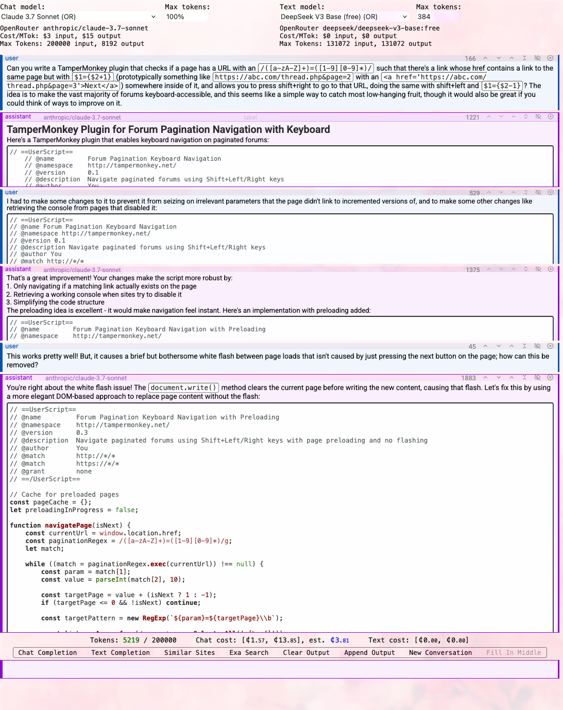
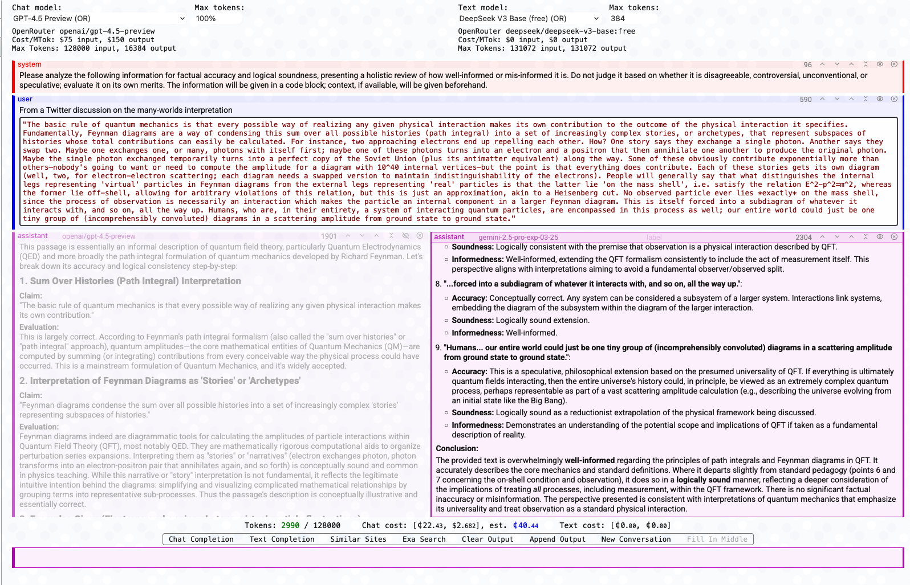
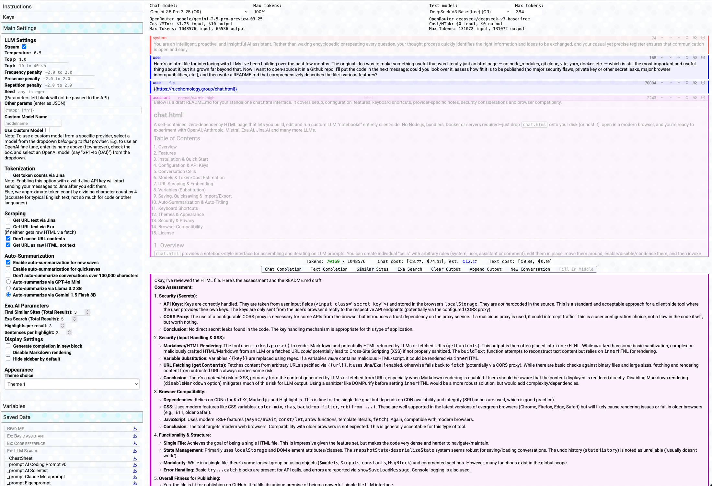

# chat.html

A self‑contained, zero‑dependency HTML page for chatting with LLMs. No Dockerfile, no yarn, no vite, no grotesque Dockerfiles or ultramassive node_modules folders—just download and open `chat.html`. 

## Overview

This HTML file provides a notebook‑style interface for assembling and iterating on LLM prompts. You can create individual “cells”, representing messages, with arbitrary roles (system, user, assistant or comment), and then edit them in place, move them around, enable/disable/condense/collapse them, add custom names and labels, and then invoke a Chat, Text, or FIM completion. Results stream in to a specified output cell which can then be turned into a new assistant message cell.

Everything runs in your browser: all state (API keys, saved conversations, variables) lives in your browser's local storage, everything is done client-side, and third‑party libraries (KaTeX, Marked, Highlight.js) are pulled from public CDNs.

Note: Because many servers treat fetch requests from browsers differently than those from other servers, you'll need a CORS proxy to use some of the providers (Anthropic, Mistral, SambaNova, and Exa, at present). It's not that hard to find a freely available CORS proxy, or to set up your own with a Cloudflare worker, but you can also just use OpenRouter to access Anthropic and Mistral LLMs.

**Warning**: This file is not stable, not meant for production, and not baby-proofed. While it works well, you should know how to use your browser's console and network tools to identify and trace back errors if and when they happen, since they're often things like rate limits, oversized files, bad parameter inputs, etc., rather than internal execution errors.

## Features

- **Multi‑provider support**: OpenAI, OpenRouter, Anthropic, Gemini, Mistral, Hyperbolic, Fireworks, Groq, SambaNova, xAI, Cerebras, custom endpoints and models. Tokenization and HTML sanitization from Jina.AI and semantic search from Exa.AI are also available.
- **Chat & Text Completions** with streaming.
- **Fill‑In‑Middle (FIM)** for text models that support the necessary `suffix` parameter (e.g. GPT‑3.5‑turbo‑instruct, DeepSeek v3).
- **Prefix enforcement** for models that support prefill (Claude, DeepSeek v3).
- **URL scraping & insertion**, optionally getting parsed content via Jina.AI or Exa.AI, otherwise fetching HTML. Wrap any valid URL in a cell with `{{https://example.com}}`. For multimodal models, writing `{{img https://example.com/picture.jpg}}` will cause the linked image to be sent at its location in the message body. (This typically works best through OpenRouter).
- **Variables** (global & local) with `{{key}}` substitution.
- **Token counting** via Jina.AI tokenizer or local heuristics.
- **Cost estimation** per‑model (input/output tokens × $/1M).
- **Keyboard‑centric** cell navigation, editing, moving, grouping, collapsing and more. Very much like a Jupyter notebook. But there are also buttons for weaker people to use.
- **Save states**: named saves, quicksave slots (0–9), undo history, import/export JSON.
- **Auto‑titles** for new saves & quicksaves (optionally automatic; can be manually triggered).
- **Multiple themes** and CSS custom‑properties for easy restyling.
- **Markdown rendering** with KaTeX math, code blocks, and syntax highlighting.

## Workflow

1a. Download or clone `chat.html`, and open it in any modern browser.
1b. You can also access it at https://n.cohomology.group/chat.html.
2. Enter your API keys under **Keys** in the left sidebar.
3. Select models, adjust parameters (temperature, max_tokens, penalties). Enter system and user messages.
4. Click **Chat Completion** (or press `\`) or **Text Completion** (press `|`).
5. Streamed results appear at the bottom. Click **Append Output** (or press `f`) to append the output to the conversation.

## Screenshots

Iterating on a Tampermonkey script with Claude. 

Getting writing assessments from multiple models. 

Asking o4-mini-high and Gemini 2.5 Pro to write a README.md for `chat.html`

MIT License.